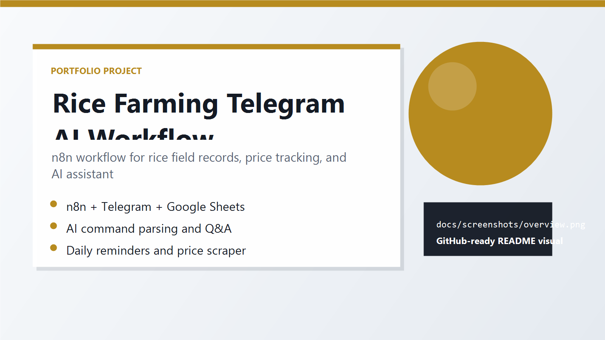

# Rice Farming Telegram AI Workflow

An n8n workflow that provides a Telegram-based rice farming assistant. The bot records rice field data, answers agriculture questions through an OpenAI-compatible chat model, tracks rice price data, sends daily reminders, and stores operational data in Google Sheets.

## Screenshots

<p align="center">
  
</p>

## Features

- Telegram bot command handling.
- Add, update, delete, and list rice field records.
- AI-assisted natural language parsing for create/update/delete workflows.
- Agriculture Q&A through an OpenAI-compatible model in n8n.
- Google Sheets data storage.
- Daily reminder and risk assessment flow.
- Scheduled rice price scraping and price history updates.
- Growth stage auto-update workflow.

## Tech Stack

| Component | Technology |
| --- | --- |
| Workflow engine | n8n |
| Messaging | Telegram Bot API |
| AI | OpenAI-compatible chat model node |
| Data store | Google Sheets |
| External data | MOC rice price scraping through HTTP Request nodes |

## Files

```text
CSI_N8N_Final-main/
  Wheat Assistance Workflow CSI - v4.json   # Main n8n workflow export
  CSI-N8N.xlsx                              # Sample spreadsheet/template data
  install_guide.docx                        # Install guide document
  README.md
  DATABASE_SCHEMA.md
```

## Setup

1. Create a Google Spreadsheet with the sheets documented in `DATABASE_SCHEMA.md`.
2. Open n8n and import `Wheat Assistance Workflow CSI - v4.json`.
3. Configure credentials for Telegram, Google Sheets, and the OpenAI-compatible chat model.
4. Check every Google Sheets node and point it to your spreadsheet.
5. Activate the workflow.
6. Open Telegram and test the bot commands.

## Data Schema

See `DATABASE_SCHEMA.md` for the Google Sheets structure.

## GitHub Notes

Before publishing, inspect the exported workflow JSON and remove embedded credential IDs, spreadsheet IDs, or private URLs if you do not want them public.
